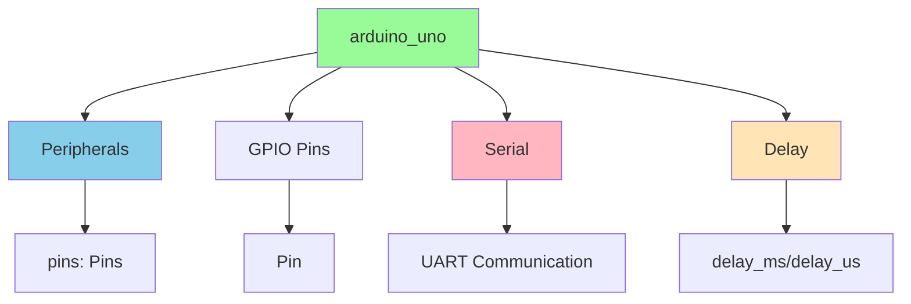
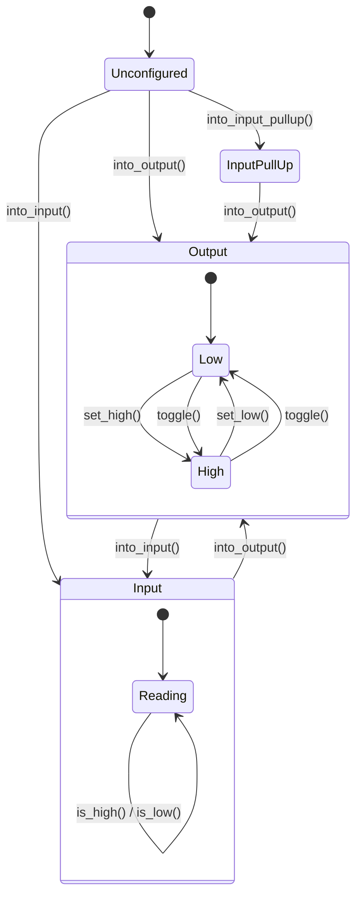

---
tags:
  - deepwiki/ossidata
  - api
  - reference
  - documentation
---

# Ossidata API Reference

**Last Updated**: 2025-10-12
**Version**: 0.1.0-dev
**Status**: 🚧 In Progress (Phase 1 - 45% Complete)

This document provides a comprehensive reference for the Ossidata Rust SDK APIs currently available for Arduino Uno.

## Table of Contents

- [Module Overview](#module-overview)
- [Core Types](#core-types)
- [GPIO (Digital I/O)](#gpio-digital-io)
- [Serial Communication](#serial-communication)
- [Timing & Delays](#timing--delays)
- [Examples](#examples)
- [Coming Soon](#coming-soon)

## Module Overview



### Available Modules

| Module | Purpose | Status | Documentation |
|--------|---------|--------|---------------|
| `arduino_uno::Peripherals` | Hardware access singleton | ✅ Complete | [Link](#peripherals) |
| `arduino_uno::Pin` | Type-safe GPIO | ✅ Complete | [Link](#gpio-digital-io) |
| `arduino_uno::Serial` | UART communication | ✅ Complete | [Link](#serial-communication) |
| `arduino_uno::Delay` | Blocking delays | ✅ Complete | [Link](#timing--delays) |
| `arduino_uno::Pwm` | PWM output | 📋 Planned | Phase 1 |
| `arduino_uno::Adc` | Analog input | 📋 Planned | Phase 1 |

## Core Types

### Peripherals

The `Peripherals` struct is the entry point to all hardware. It's a **singleton** - only one instance can exist.

```rust
pub struct Peripherals {
    pub pins: Pins,
}
```

#### Methods

##### `Peripherals::take()`

Takes ownership of the peripherals singleton.

```rust
pub fn take() -> Option<Self>
```

**Returns**: `Some(Peripherals)` on first call, `None` on subsequent calls

**Example**:
```rust
let peripherals = Peripherals::take()
    .expect("Failed to take peripherals");
```

**Safety**: This function ensures only one instance of `Peripherals` exists, preventing multiple mutable accesses to hardware.

---

### Pins

Container for all GPIO pins on the Arduino Uno.

```rust
pub struct Pins {
    pub d0: Pin<0, Unconfigured>,
    pub d1: Pin<1, Unconfigured>,
    // ... d2-d12
    pub d13: Pin<13, Unconfigured>,  // Built-in LED
    // Future: analog pins a0-a5
}
```

**Available Pins**: D0-D13 (digital), A0-A5 (analog, coming soon)

> ⚠️ **Note**: D0 and D1 are used for USB serial - avoid using them for GPIO

---

## GPIO (Digital I/O)

GPIO provides type-safe digital input/output with compile-time mode checking.

### Pin<N, MODE>

Generic pin type where:
- `N` is the pin number (0-13)
- `MODE` is the pin mode (`Output`, `Input`, `InputPullUp`, `Unconfigured`)

```rust
pub struct Pin<const N: u8, MODE> {
    // Zero-sized - no runtime overhead!
}
```

### Pin Modes



#### Output Mode

Methods available on `Pin<N, Output>`:

##### `into_output()`

Configure pin as output.

```rust
pub fn into_output(self) -> Pin<N, Output>
```

**Example**:
```rust
let mut led = peripherals.pins.d13.into_output();
```

---

##### `set_high()`

Set pin output to HIGH (5V on Uno).

```rust
pub fn set_high(&mut self)
```

**Example**:
```rust
led.set_high();  // Turn LED on
```

---

##### `set_low()`

Set pin output to LOW (0V).

```rust
pub fn set_low(&mut self)
```

**Example**:
```rust
led.set_low();  // Turn LED off
```

---

##### `toggle()`

Toggle pin state (HIGH→LOW or LOW→HIGH).

```rust
pub fn toggle(&mut self)
```

**Example**:
```rust
led.toggle();  // Flip LED state
```

---

#### Input Mode

Methods available on `Pin<N, Input>`:

##### `into_input()`

Configure pin as input (floating).

```rust
pub fn into_input(self) -> Pin<N, Input>
```

**Example**:
```rust
let button = peripherals.pins.d2.into_input();
```

---

##### `into_input_pullup()`

Configure pin as input with internal pull-up resistor enabled.

```rust
pub fn into_input_pullup(self) -> Pin<N, InputPullUp>
```

**Example**:
```rust
let button = peripherals.pins.d2.into_input_pullup();
```

**Use case**: Buttons connected to ground (pressed = LOW, released = HIGH)

---

##### `is_high()`

Read pin state - returns `true` if HIGH.

```rust
pub fn is_high(&self) -> bool
```

**Example**:
```rust
if button.is_high() {
    // Button not pressed (pull-up enabled)
}
```

---

##### `is_low()`

Read pin state - returns `true` if LOW.

```rust
pub fn is_low(&self) -> bool
```

**Example**:
```rust
if button.is_low() {
    // Button pressed (connected to ground)
}
```

---

### GPIO Example

Complete example showing pin mode transitions:

```rust
#![no_std]
#![no_main]

use arduino_uno::{Peripherals, Delay};
use panic_halt as _;

#[avr_device::entry]
fn main() -> ! {
    let peripherals = Peripherals::take().unwrap();
    let mut delay = Delay::new();

    // Start as output
    let mut pin = peripherals.pins.d13.into_output();
    pin.set_high();
    delay.delay_ms(1000);

    // Switch to input
    let pin = pin.into_input();
    let state = pin.is_high();

    // Switch back to output
    let mut pin = pin.into_output();
    if state {
        pin.set_high();
    }

    loop {}
}
```

---

## Serial Communication

The `Serial` struct provides UART communication over USB.

### Serial

```rust
pub struct Serial {
    // Internal UART state
}
```

### Constructor

##### `Serial::new(baud_rate)`

Initialize serial communication.

```rust
pub fn new(baud_rate: u32) -> Self
```

**Parameters**:
- `baud_rate`: Communication speed (common: 9600, 115200)

**Example**:
```rust
let mut serial = Serial::new(9600);
```

**Baud Rates**:
| Baud Rate | Use Case | Reliability |
|-----------|----------|-------------|
| 9600 | Default, most compatible | Excellent |
| 19200 | Faster, still reliable | Excellent |
| 38400 | Fast | Good |
| 57600 | Very fast | Good |
| 115200 | Maximum speed | Fair (can have errors) |

---

### Write Methods

##### `write_byte()`

Write a single byte.

```rust
pub fn write_byte(&mut self, byte: u8)
```

**Example**:
```rust
serial.write_byte(b'A');        // Send 'A'
serial.write_byte(0x41);        // Same as 'A'
serial.write_byte(b'\n');       // Newline
```

---

##### `write_str()`

Write a string slice.

```rust
pub fn write_str(&mut self, s: &str)
```

**Example**:
```rust
serial.write_str("Hello, World!");
```

**Note**: String must be a `&str` (string slice), not `String` (no heap allocation)

---

##### `println()`

Write a string followed by newline (`\r\n`).

```rust
pub fn println(&mut self, s: &str)
```

**Example**:
```rust
serial.println("Hello, World!");
// Outputs: "Hello, World!\r\n"
```

---

##### `print_newline()`

Write a newline character.

```rust
pub fn print_newline(&mut self)
```

**Example**:
```rust
serial.print_newline();  // Same as write_byte(b'\n')
```

---

### Read Methods

##### `available()`

Check how many bytes are available to read.

```rust
pub fn available(&self) -> u8
```

**Returns**: Number of bytes in receive buffer (0 if empty)

**Example**:
```rust
if serial.available() > 0 {
    // Data is available
}
```

---

##### `read()`

Read a single byte (blocking if no data available).

```rust
pub fn read(&mut self) -> u8
```

**Returns**: The byte read

**Example**:
```rust
if serial.available() > 0 {
    let byte = serial.read();
    serial.write_byte(byte);  // Echo it back
}
```

**Warning**: This function blocks until data is available!

---

### Serial Example

Interactive echo example:

```rust
#![no_std]
#![no_main]

use arduino_uno::{Serial, Delay};
use panic_halt as _;

#[avr_device::entry]
fn main() -> ! {
    let mut serial = Serial::new(9600);
    let mut delay = Delay::new();

    serial.println("Serial Echo Ready!");
    serial.println("Type something...");

    loop {
        if serial.available() > 0 {
            let byte = serial.read();

            // Echo the byte
            serial.write_str("You typed: ");
            serial.write_byte(byte);
            serial.print_newline();
        }

        delay.delay_ms(10);
    }
}
```

---

## Timing & Delays

### Delay

Provides blocking delays using busy-wait loops.

```rust
pub struct Delay {
    // Internal timing state
}
```

### Constructor

##### `Delay::new()`

Create a new delay instance.

```rust
pub fn new() -> Self
```

**Example**:
```rust
let mut delay = Delay::new();
```

---

### Methods

##### `delay_ms()`

Delay for a specified number of milliseconds.

```rust
pub fn delay_ms(&mut self, ms: u16)
```

**Parameters**:
- `ms`: Delay duration in milliseconds (0-65535)

**Example**:
```rust
delay.delay_ms(1000);  // Wait 1 second
```

**Accuracy**: ±1% at 16MHz clock

---

##### `delay_us()`

Delay for a specified number of microseconds.

```rust
pub fn delay_us(&mut self, us: u16)
```

**Parameters**:
- `us`: Delay duration in microseconds (0-65535)

**Example**:
```rust
delay.delay_us(100);  // Wait 100 microseconds
```

**Accuracy**: ±5% for short delays

---

### Delay Example

```rust
#![no_std]
#![no_main]

use arduino_uno::{Peripherals, Delay};
use panic_halt as _;

#[avr_device::entry]
fn main() -> ! {
    let peripherals = Peripherals::take().unwrap();
    let mut led = peripherals.pins.d13.into_output();
    let mut delay = Delay::new();

    loop {
        led.set_high();
        delay.delay_ms(100);    // On for 100ms

        led.set_low();
        delay.delay_us(100_000); // Off for 100ms (100,000 microseconds)
    }
}
```

**Note**: `delay_us()` max is 65535, so for longer delays use `delay_ms()`

---

## Examples

### Complete Programs

#### Blink LED

```rust
#![no_std]
#![no_main]

use arduino_uno::{Peripherals, Delay};
use panic_halt as _;

#[avr_device::entry]
fn main() -> ! {
    let peripherals = Peripherals::take().unwrap();
    let mut led = peripherals.pins.d13.into_output();
    let mut delay = Delay::new();

    loop {
        led.set_high();
        delay.delay_ms(500);
        led.set_low();
        delay.delay_ms(500);
    }
}
```

**Binary size**: 844 bytes

---

#### Hello World

```rust
#![no_std]
#![no_main]

use arduino_uno::{Serial, Delay};
use panic_halt as _;

#[avr_device::entry]
fn main() -> ! {
    let mut serial = Serial::new(9600);
    let mut delay = Delay::new();

    serial.println("Hello, World!");

    let mut count = 0u32;
    loop {
        serial.write_str("Count: ");
        // TODO: Need number formatting
        serial.print_newline();

        count = count.wrapping_add(1);
        delay.delay_ms(1000);
    }
}
```

**Binary size**: 2.6 KB

---

#### Button Input

```rust
#![no_std]
#![no_main]

use arduino_uno::{Peripherals, Delay};
use panic_halt as _;

#[avr_device::entry]
fn main() -> ! {
    let peripherals = Peripherals::take().unwrap();
    let mut led = peripherals.pins.d13.into_output();
    let button = peripherals.pins.d2.into_input_pullup();
    let mut delay = Delay::new();

    loop {
        if button.is_low() {  // Button pressed (connected to GND)
            led.set_high();
        } else {
            led.set_low();
        }

        delay.delay_ms(10);  // Debounce delay
    }
}
```

**Binary size**: 728 bytes

---

## Coming Soon

### Planned APIs (Phase 1 Completion)

#### PWM (Pulse Width Modulation)

```rust
// Coming soon!
let mut pwm = peripherals.pins.d9.into_pwm();
pwm.set_duty(128);  // 50% duty cycle (0-255)
```

**Use cases**: LED fading, motor speed control

---

#### ADC (Analog to Digital Converter)

```rust
// Coming soon!
let mut adc = peripherals.pins.a0.into_analog();
let value = adc.read();  // 0-1023 (10-bit)
```

**Use cases**: Reading sensors, potentiometers, voltage monitoring

---

### Future APIs (Phase 2+)

- **I2C**: `i2c.write(address, data)`
- **SPI**: `spi.transfer(data)`
- **Timers**: `Timer::new().start(1000)`
- **Interrupts**: `pins.d2.enable_interrupt(handler)`

---

## API Design Principles

### Type Safety

```rust
// ✅ Correct
let mut pin = pins.d13.into_output();
pin.set_high();

// ❌ Compile error
let pin = pins.d13.into_input();
pin.set_high();  // ERROR: Input pins can't be set
```

### Zero-Cost Abstractions

All APIs compile to direct register access:

```rust
pin.set_high();  // Compiles to: sbi PORTB, 5
```

No function calls, no overhead!

### No Panic in Hot Path

```rust
// Good: No allocation, no panic
serial.write_str("Hello");

// Avoid: Would panic if no heap
// let s = format!("Value: {}", 42);  // DON'T DO THIS
```

---

## Error Handling

Currently, most operations are infallible:

```rust
pin.set_high();  // Can't fail
serial.write_byte(b'A');  // Can't fail (may block)
```

Future versions will add `Result` types for fallible operations:

```rust
// Future API
adc.read()?;  // Returns Result<u16, AdcError>
```

---

## Reference Tables

### Pin Capabilities (Arduino Uno)

| Pin | Digital I/O | PWM | Analog In | Special Function |
|-----|-------------|-----|-----------|------------------|
| D0 | ✅ | ❌ | ❌ | RX (Serial) |
| D1 | ✅ | ❌ | ❌ | TX (Serial) |
| D2-D12 | ✅ | Some | ❌ | External interrupts |
| D13 | ✅ | ❌ | ❌ | Built-in LED |
| A0-A5 | ✅ | ❌ | ✅ | Analog input (10-bit) |

### Memory Limits

| Resource | Arduino Uno | Notes |
|----------|-------------|-------|
| Flash | 32 KB | Bootloader uses ~2KB |
| RAM | 2 KB | Very limited! |
| EEPROM | 1 KB | Persistent storage |
| Registers | 224 bytes | Fast access |

---

## Best Practices

### Memory Efficiency

```rust
// ❌ Bad - uses heap (doesn't compile in no_std)
// let s = String::from("Hello");

// ✅ Good - string slice in flash
let s = "Hello";

// ✅ Good - fixed-size buffer on stack
let mut buf = [0u8; 64];
```

### Pin Mode Transitions

```rust
// Switch pin modes as needed
let mut pin = pins.d13.into_output();
pin.set_high();

// Switch to input
let pin = pin.into_input();
let state = pin.is_high();

// Switch back
let mut pin = pin.into_output();
```

### Serial Buffering

```rust
// Check before reading
if serial.available() > 0 {
    let byte = serial.read();
    // Process byte
}

// Don't busy-wait without delay
loop {
    if serial.available() > 0 {
        // Process
    }
    delay.delay_ms(10);  // Give CPU a break
}
```

---

## Additional Resources

- **Full Documentation**: [docs.rs/ossidata](https://docs.rs/ossidata) *(coming soon)*
- **Getting Started**: [GETTING_STARTED.md](GETTING_STARTED.md)
- **Architecture**: [ARCHITECTURE.md](ARCHITECTURE.md)
- **Examples**: `boards/arduino-uno/src/bin/`

---

## Feedback

Found an issue or have a suggestion? [Open an issue](https://github.com/ScopeCreep-zip/ossidata/issues)!

---

**Version**: 0.1.0-dev | **Last Updated**: 2025-10-12 | **Status**: 🚧 Phase 1 (45% Complete)
