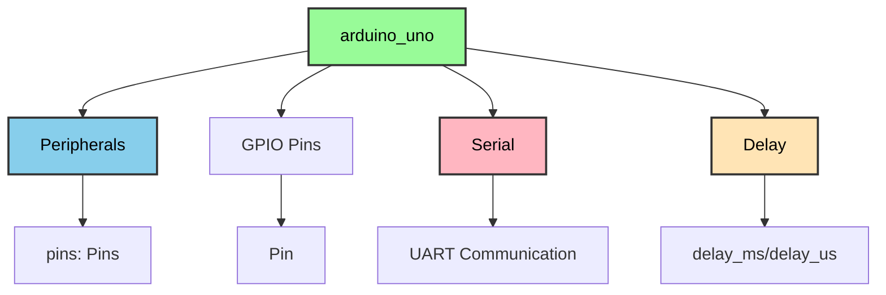
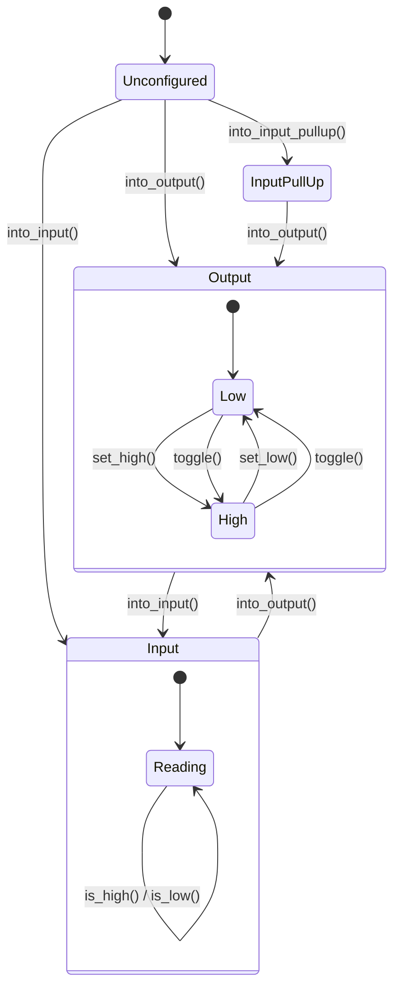

---
tags:
  - deepwiki/ossidata
  - api
  - reference
  - documentation
---

# Ossidata API Reference

**Last Updated**: 2025-11-05
**Version**: 0.1.0-dev
**Status**: 🚧 In Progress (82% Complete)

This document provides a comprehensive reference for the Ossidata Rust SDK APIs currently available for Arduino Uno.

## How to Use This Reference

This reference is designed for all skill levels:

**For Beginners:**
- Start with [Getting Started Guide](GETTING_STARTED.md) first
- Look at the **Examples** section in each API
- Read the "**What it does**" explanations in plain English

**For Intermediate Users:**
- Jump to specific features using the [Table of Contents](#table-of-contents)
- Check function signatures and return types
- Compare with Arduino C++ equivalents (provided where helpful)

**For Advanced Users:**
- Review type signatures and trait implementations
- Understand ownership and lifetime semantics
- Explore zero-cost abstraction implementations

Each API section includes:
- **Purpose**: What the API does in simple terms
- **Basic Example**: Working code you can copy and modify
- **API Details**: Function signatures, parameters, return types
- **Hardware Notes**: Pin assignments, timing, limitations

## Table of Contents

- [Module Overview](#module-overview)
- [Core Types](#core-types)
- [GPIO (Digital I/O)](#gpio-digital-io)
- [PWM (Pulse Width Modulation)](#pwm-pulse-width-modulation)
- [ADC (Analog Input)](#adc-analog-input)
- [Serial Communication](#serial-communication)
- [I2C Communication](#i2c-communication)
- [SPI Communication](#spi-communication)
- [LCD Display](#lcd-display)
- [RTC (Real-Time Clock)](#rtc-real-time-clock)
- [Timing & Delays](#timing--delays)
- [Examples](#examples)
- [Coming Soon](#coming-soon)

## Module Overview



### Available Modules

| Module | Purpose | Status | Documentation |
|--------|---------|--------|---------------|
| `arduino_uno::Peripherals` | Hardware access singleton | ✅ Complete | [Link](#peripherals) |
| `arduino_uno::Pin` | Type-safe GPIO | ✅ Complete | [Link](#gpio-digital-io) |
| `arduino_uno::Pwm` | PWM output (6 channels) | ✅ Complete | [Link](#pwm-pulse-width-modulation) |
| `arduino_uno::Adc` | Analog input (6 pins) | ✅ Complete | [Link](#adc-analog-input) |
| `arduino_uno::Serial` | UART communication | ✅ Complete | [Link](#serial-communication) |
| `arduino_uno::I2c` | I2C master mode | ✅ Complete | [Link](#i2c-communication) |
| `arduino_uno::Spi` | SPI master mode | ✅ Complete | [Link](#spi-communication) |
| `arduino_uno::Lcd` | LCD HD44780 driver | ✅ Complete | [Link](#lcd-display) |
| `arduino_uno::Rtc` | RTC driver (DS1307/DS3231) | ✅ Complete | [Link](#rtc-real-time-clock) |
| `arduino_uno::millis` | Millisecond timing | ✅ Complete | [Link](#timing--delays) |
| `arduino_uno::micros` | Microsecond timing | ✅ Complete | [Link](#timing--delays) |
| `arduino_uno::Delay` | Blocking delays | ✅ Complete | [Link](#timing--delays) |
| `arduino_uno::Eeprom` | Non-volatile memory | ✅ Complete | [Link](#eeprom-non-volatile-memory) |
| `arduino_uno::tone` | Audio tone generation | ✅ Complete | [Link](#tone-generation) |
| `arduino_uno::attach_interrupt` | External interrupts | ✅ Complete | [Link](#interrupts) |
| `arduino_uno::pulse_in` | Pulse width measurement | ✅ Complete | [Link](#pulse-measurement) |
| `arduino_uno::shift_out` | Shift register operations | ✅ Complete | [Link](#shift-registers) |

## Core Types

### Peripherals

The `Peripherals` struct is the entry point to all hardware. It's a **singleton** - only one instance can exist.

```rust
pub struct Peripherals {
    pub pins: Pins,
}
```

#### Methods

##### `Peripherals::take()`

Takes ownership of the peripherals singleton.

```rust
pub fn take() -> Option<Self>
```

**Returns**: `Some(Peripherals)` on first call, `None` on subsequent calls

**Example**:
```rust
let peripherals = Peripherals::take()
    .expect("Failed to take peripherals");
```

**Safety**: This function ensures only one instance of `Peripherals` exists, preventing multiple mutable accesses to hardware.

---

### Pins

Container for all GPIO pins on the Arduino Uno.

```rust
pub struct Pins {
    pub d0: Pin<0, Unconfigured>,
    pub d1: Pin<1, Unconfigured>,
    // ... d2-d12
    pub d13: Pin<13, Unconfigured>,  // Built-in LED
    // Future: analog pins a0-a5
}
```

**Available Pins**: D0-D13 (digital), A0-A5 (analog, coming soon)

> ⚠️ **Note**: D0 and D1 are used for USB serial - avoid using them for GPIO

---

## GPIO (Digital I/O)

GPIO provides type-safe digital input/output with compile-time mode checking.

### Pin<N, MODE>

Generic pin type where:
- `N` is the pin number (0-13)
- `MODE` is the pin mode (`Output`, `Input`, `InputPullUp`, `Unconfigured`)

```rust
pub struct Pin<const N: u8, MODE> {
    // Zero-sized - no runtime overhead!
}
```

### Pin Modes



#### Output Mode

Methods available on `Pin<N, Output>`:

##### `into_output()`

Configure pin as output.

```rust
pub fn into_output(self) -> Pin<N, Output>
```

**Example**:
```rust
let mut led = peripherals.pins.d13.into_output();
```

---

##### `set_high()`

Set pin output to HIGH (5V on Uno).

```rust
pub fn set_high(&mut self)
```

**Example**:
```rust
led.set_high();  // Turn LED on
```

---

##### `set_low()`

Set pin output to LOW (0V).

```rust
pub fn set_low(&mut self)
```

**Example**:
```rust
led.set_low();  // Turn LED off
```

---

##### `toggle()`

Toggle pin state (HIGH→LOW or LOW→HIGH).

```rust
pub fn toggle(&mut self)
```

**Example**:
```rust
led.toggle();  // Flip LED state
```

---

#### Input Mode

Methods available on `Pin<N, Input>`:

##### `into_input()`

Configure pin as input (floating).

```rust
pub fn into_input(self) -> Pin<N, Input>
```

**Example**:
```rust
let button = peripherals.pins.d2.into_input();
```

---

##### `into_input_pullup()`

Configure pin as input with internal pull-up resistor enabled.

```rust
pub fn into_input_pullup(self) -> Pin<N, InputPullUp>
```

**Example**:
```rust
let button = peripherals.pins.d2.into_input_pullup();
```

**Use case**: Buttons connected to ground (pressed = LOW, released = HIGH)

---

##### `is_high()`

Read pin state - returns `true` if HIGH.

```rust
pub fn is_high(&self) -> bool
```

**Example**:
```rust
if button.is_high() {
    // Button not pressed (pull-up enabled)
}
```

---

##### `is_low()`

Read pin state - returns `true` if LOW.

```rust
pub fn is_low(&self) -> bool
```

**Example**:
```rust
if button.is_low() {
    // Button pressed (connected to ground)
}
```

---

### GPIO Example

Complete example showing pin mode transitions:

```rust
#![no_std]
#![no_main]

use arduino_uno::{Peripherals, Delay};
use panic_halt as _;

#[avr_device::entry]
fn main() -> ! {
    let peripherals = Peripherals::take().unwrap();
    let mut delay = Delay::new();

    // Start as output
    let mut pin = peripherals.pins.d13.into_output();
    pin.set_high();
    delay.delay_ms(1000);

    // Switch to input
    let pin = pin.into_input();
    let state = pin.is_high();

    // Switch back to output
    let mut pin = pin.into_output();
    if state {
        pin.set_high();
    }

    loop {}
}
```

---

## Serial Communication

The `Serial` struct provides UART communication over USB.

### Serial

```rust
pub struct Serial {
    // Internal UART state
}
```

### Constructor

##### `Serial::new(baud_rate)`

Initialize serial communication.

```rust
pub fn new(baud_rate: u32) -> Self
```

**Parameters**:
- `baud_rate`: Communication speed (common: 9600, 115200)

**Example**:
```rust
let mut serial = Serial::new(9600);
```

**Baud Rates**:
| Baud Rate | Use Case | Reliability |
|-----------|----------|-------------|
| 9600 | Default, most compatible | Excellent |
| 19200 | Faster, still reliable | Excellent |
| 38400 | Fast | Good |
| 57600 | Very fast | Good |
| 115200 | Maximum speed | Fair (can have errors) |

---

### Write Methods

##### `write_byte()`

Write a single byte.

```rust
pub fn write_byte(&mut self, byte: u8)
```

**Example**:
```rust
serial.write_byte(b'A');        // Send 'A'
serial.write_byte(0x41);        // Same as 'A'
serial.write_byte(b'\n');       // Newline
```

---

##### `write_str()`

Write a string slice.

```rust
pub fn write_str(&mut self, s: &str)
```

**Example**:
```rust
serial.write_str("Hello, World!");
```

**Note**: String must be a `&str` (string slice), not `String` (no heap allocation)

---

##### `println()`

Write a string followed by newline (`\r\n`).

```rust
pub fn println(&mut self, s: &str)
```

**Example**:
```rust
serial.println("Hello, World!");
// Outputs: "Hello, World!\r\n"
```

---

##### `print_newline()`

Write a newline character.

```rust
pub fn print_newline(&mut self)
```

**Example**:
```rust
serial.print_newline();  // Same as write_byte(b'\n')
```

---

### Read Methods

##### `available()`

Check how many bytes are available to read.

```rust
pub fn available(&self) -> u8
```

**Returns**: Number of bytes in receive buffer (0 if empty)

**Example**:
```rust
if serial.available() > 0 {
    // Data is available
}
```

---

##### `read()`

Read a single byte (blocking if no data available).

```rust
pub fn read(&mut self) -> u8
```

**Returns**: The byte read

**Example**:
```rust
if serial.available() > 0 {
    let byte = serial.read();
    serial.write_byte(byte);  // Echo it back
}
```

**Warning**: This function blocks until data is available!

---

### Serial Example

Interactive echo example:

```rust
#![no_std]
#![no_main]

use arduino_uno::{Serial, Delay};
use panic_halt as _;

#[avr_device::entry]
fn main() -> ! {
    let mut serial = Serial::new(9600);
    let mut delay = Delay::new();

    serial.println("Serial Echo Ready!");
    serial.println("Type something...");

    loop {
        if serial.available() > 0 {
            let byte = serial.read();

            // Echo the byte
            serial.write_str("You typed: ");
            serial.write_byte(byte);
            serial.print_newline();
        }

        delay.delay_ms(10);
    }
}
```

---

## PWM (Pulse Width Modulation)

PWM allows control of analog output using digital pins. The ATmega328P provides 6 PWM-capable pins.

### Available PWM Pins

| Pin | Timer | Channel | Notes |
|-----|-------|---------|-------|
| D3 | Timer2 | OC2B | 8-bit |
| D5 | Timer0 | OC0B | 8-bit (shared with millis) |
| D6 | Timer0 | OC0A | 8-bit (shared with millis) |
| D9 | Timer1 | OC1A | 16-bit (used as 8-bit) |
| D10 | Timer1 | OC1B | 16-bit (used as 8-bit) |
| D11 | Timer2 | OC2A | 8-bit |

### PwmFrequency

Predefined frequency options for PWM output.

```rust
pub enum PwmFrequency {
    Freq980Hz,   // ~980 Hz - good for LEDs
    Freq3_9kHz,  // ~3.9 kHz - good for motors
    Freq31kHz,   // ~31 kHz - high frequency
}
```

**Use cases**:
- `Freq980Hz`: LED dimming, low-speed control
- `Freq3_9kHz`: Motor speed control, servo control
- `Freq31kHz`: High-frequency applications, reduced audible noise

---

### Pin<N, Output>::into_pwm()

Convert an output pin to PWM mode.

```rust
pub fn into_pwm(self, freq: PwmFrequency) -> Pin<N, Pwm>
```

**Parameters**:
- `freq`: PWM frequency setting

**Returns**: Pin in PWM mode

**Example**:
```rust
let mut pwm_pin = peripherals.pins.d9.into_output().into_pwm(PwmFrequency::Freq980Hz);
```

**Available on**: Pins D3, D5, D6, D9, D10, D11

---

### Pin<N, Pwm>::set_duty()

Set the PWM duty cycle.

```rust
pub fn set_duty(&mut self, duty: u8)
```

**Parameters**:
- `duty`: Duty cycle value (0-255)
  - 0 = 0% (always LOW)
  - 128 = 50% (half power)
  - 255 = 100% (always HIGH)

**Example**:
```rust
pwm_pin.set_duty(64);   // 25% duty cycle
pwm_pin.set_duty(128);  // 50% duty cycle
pwm_pin.set_duty(192);  // 75% duty cycle
```

---

### Pin<N, Pwm>::into_output()

Convert PWM pin back to regular output mode.

```rust
pub fn into_output(self) -> Pin<N, Output>
```

**Returns**: Pin in output mode

**Example**:
```rust
let output_pin = pwm_pin.into_output();
```

---

### PWM Example - LED Fade

```rust
#![no_std]
#![no_main]

use arduino_uno::{Peripherals, Delay, pwm::PwmFrequency};
use panic_halt as _;

#[avr_device::entry]
fn main() -> ! {
    let peripherals = Peripherals::take().unwrap();
    let mut pwm = peripherals.pins.d9.into_output()
        .into_pwm(PwmFrequency::Freq980Hz);
    let mut delay = Delay::new();

    loop {
        // Fade in
        for duty in 0..=255 {
            pwm.set_duty(duty);
            delay.delay_ms(5);
        }

        // Fade out
        for duty in (0..=255).rev() {
            pwm.set_duty(duty);
            delay.delay_ms(5);
        }
    }
}
```

---

## ADC (Analog Input)

The ADC provides 10-bit analog-to-digital conversion on pins A0-A5.

### Adc

Main ADC controller struct.

```rust
pub struct Adc {
    // Internal ADC state
}
```

### AdcReference

Voltage reference selection for ADC measurements.

```rust
pub enum AdcReference {
    AVcc,         // AVCC with external capacitor (default, typically 5V)
    Internal1V1,  // Internal 1.1V reference
    External,     // External reference on AREF pin
}
```

**Use cases**:
- `AVcc`: General purpose measurements (0-5V)
- `Internal1V1`: High precision for low voltages (0-1.1V)
- `External`: Custom reference voltage

---

### Adc::new()

Create ADC with default settings (AVCC reference).

```rust
pub fn new() -> Self
```

**Example**:
```rust
let mut adc = Adc::new();
```

---

### Adc::with_reference()

Create ADC with specific voltage reference.

```rust
pub fn with_reference(reference: AdcReference) -> Self
```

**Parameters**:
- `reference`: Voltage reference to use

**Example**:
```rust
let mut adc = Adc::with_reference(AdcReference::Internal1V1);
```

---

### Adc::set_reference()

Change the voltage reference.

```rust
pub fn set_reference(&mut self, reference: AdcReference)
```

**Example**:
```rust
adc.set_reference(AdcReference::AVcc);
```

---

### Adc::read_channel()

Read a 10-bit value from an ADC channel.

```rust
pub fn read_channel(&mut self, channel: u8) -> u16
```

**Parameters**:
- `channel`: ADC channel number (0-5 for A0-A5)

**Returns**: ADC reading (0-1023)

**Example**:
```rust
let value = adc.read_channel(0);  // Read A0
```

---

### Convenience Methods

```rust
pub fn read_a0(&mut self) -> u16
pub fn read_a1(&mut self) -> u16
pub fn read_a2(&mut self) -> u16
pub fn read_a3(&mut self) -> u16
pub fn read_a4(&mut self) -> u16
pub fn read_a5(&mut self) -> u16
```

**Example**:
```rust
let value = adc.read_a0();  // Same as read_channel(0)
```

---

### Adc::reading_to_millivolts()

Convert ADC reading to voltage in millivolts.

```rust
pub fn reading_to_millivolts(&self, reading: u16) -> u16
```

**Parameters**:
- `reading`: ADC reading (0-1023)

**Returns**: Voltage in millivolts

**Example**:
```rust
let reading = adc.read_a0();
let voltage_mv = adc.reading_to_millivolts(reading);
// For AVCC (5V): 512 reading = 2500mV
```

---

### ADC Example - Read Sensor

```rust
#![no_std]
#![no_main]

use arduino_uno::{Serial, Delay, Adc};
use panic_halt as _;

#[avr_device::entry]
fn main() -> ! {
    let mut serial = Serial::new(9600);
    let mut adc = Adc::new();
    let mut delay = Delay::new();

    serial.println("ADC Reading Started");

    loop {
        let raw = adc.read_a0();
        let voltage_mv = adc.reading_to_millivolts(raw);

        serial.write_str("Raw: ");
        // TODO: Add number formatting
        serial.write_str(" Voltage: ");
        serial.println("mV");

        delay.delay_ms(500);
    }
}
```

---

## I2C Communication

I2C (TWI) provides master mode communication on pins A4 (SDA) and A5 (SCL).

### I2c

I2C master controller.

```rust
pub struct I2c {
    // Internal I2C state
}
```

### I2cError

Error types for I2C operations.

```rust
pub enum I2cError {
    Nack,      // No acknowledgment received
    Timeout,   // Operation timeout
    BusError,  // Bus error or arbitration lost
}
```

---

### I2c::new()

Initialize I2C with 100kHz clock (standard mode).

```rust
pub fn new() -> Self
```

**Example**:
```rust
let i2c = I2c::new();
```

---

### I2c::with_frequency()

Initialize I2C with custom frequency.

```rust
pub fn with_frequency(freq_hz: u32) -> Self
```

**Parameters**:
- `freq_hz`: I2C frequency in Hz (common: 100000, 400000)

**Example**:
```rust
let i2c = I2c::with_frequency(400_000);  // 400kHz fast mode
```

---

### I2c::write()

Write data to an I2C device.

```rust
pub fn write(&self, address: u8, data: &[u8]) -> Result<(), I2cError>
```

**Parameters**:
- `address`: 7-bit I2C device address
- `data`: Data bytes to write

**Returns**: `Ok(())` on success, `Err(I2cError)` on failure

**Example**:
```rust
i2c.write(0x3C, &[0x00, 0xFF])?;
```

---

### I2c::read()

Read data from an I2C device.

```rust
pub fn read(&self, address: u8, buffer: &mut [u8]) -> Result<(), I2cError>
```

**Parameters**:
- `address`: 7-bit I2C device address
- `buffer`: Buffer to store received data

**Example**:
```rust
let mut buf = [0u8; 4];
i2c.read(0x3C, &mut buf)?;
```

---

### I2c::write_register()

Write to a device register.

```rust
pub fn write_register(&self, address: u8, register: u8, data: &[u8]) -> Result<(), I2cError>
```

**Parameters**:
- `address`: 7-bit I2C device address
- `register`: Register address
- `data`: Data bytes to write

**Example**:
```rust
i2c.write_register(0x68, 0x00, &[0x01, 0x02, 0x03])?;
```

---

### I2c::read_register()

Read from a device register.

```rust
pub fn read_register(&self, address: u8, register: u8, buffer: &mut [u8]) -> Result<(), I2cError>
```

**Parameters**:
- `address`: 7-bit I2C device address
- `register`: Register address
- `buffer`: Buffer to store received data

**Example**:
```rust
let mut buf = [0u8; 2];
i2c.read_register(0x68, 0x00, &mut buf)?;
```

---

### I2c::scan()

Scan I2C bus for connected devices.

```rust
pub fn scan(&self) -> [bool; 128]
```

**Returns**: Array where `true` indicates a device at that address

**Example**:
```rust
let devices = i2c.scan();
for (addr, &present) in devices.iter().enumerate() {
    if present {
        // Device found at address `addr`
    }
}
```

---

### I2C Example - Scanner

```rust
#![no_std]
#![no_main]

use arduino_uno::{Serial, I2c, Delay};
use panic_halt as _;

#[avr_device::entry]
fn main() -> ! {
    let mut serial = Serial::new(9600);
    let i2c = I2c::new();
    let mut delay = Delay::new();

    serial.println("I2C Scanner");

    let devices = i2c.scan();
    serial.write_str("Found devices at: ");
    for (addr, &present) in devices.iter().enumerate() {
        if present {
            // Print address (hex formatting needed)
            serial.write_str("0x");
        }
    }

    loop {
        delay.delay_ms(1000);
    }
}
```

---

## SPI Communication

SPI provides high-speed master mode communication using pins D10 (SS), D11 (MOSI), D12 (MISO), D13 (SCK).

### Spi

SPI master controller.

```rust
pub struct Spi {
    // Internal SPI state
}
```

### SpiClock

Clock speed divider settings.

```rust
pub enum SpiClock {
    Div2,    // 8 MHz
    Div4,    // 4 MHz (default)
    Div8,    // 2 MHz
    Div16,   // 1 MHz
    Div32,   // 500 kHz
    Div64,   // 250 kHz
    Div128,  // 125 kHz
}
```

---

### SpiMode

Clock polarity and phase combinations.

```rust
pub enum SpiMode {
    Mode0,  // CPOL=0, CPHA=0 (most common)
    Mode1,  // CPOL=0, CPHA=1
    Mode2,  // CPOL=1, CPHA=0
    Mode3,  // CPOL=1, CPHA=1
}
```

---

### BitOrder

Data bit order.

```rust
pub enum BitOrder {
    MsbFirst,  // Most significant bit first (default)
    LsbFirst,  // Least significant bit first
}
```

---

### SpiSettings

Configuration for SPI devices.

```rust
pub struct SpiSettings {
    // Internal configuration
}
```

#### SpiSettings::new()

Create SPI settings.

```rust
pub fn new(clock: SpiClock, bit_order: BitOrder, mode: SpiMode) -> Self
```

**Example**:
```rust
let settings = SpiSettings::new(
    SpiClock::Div4,
    BitOrder::MsbFirst,
    SpiMode::Mode0
);
```

#### SpiSettings::default()

Default settings (4MHz, MSB first, Mode 0).

```rust
impl Default for SpiSettings
```

---

### Spi::new()

Initialize SPI in master mode.

```rust
pub fn new() -> Self
```

**Example**:
```rust
let mut spi = Spi::new();
```

**Note**: SS pin (D10) must be controlled manually by your application.

---

### Spi::begin_transaction()

Begin transaction with specific settings.

```rust
pub fn begin_transaction(&mut self, settings: SpiSettings)
```

**Example**:
```rust
let settings = SpiSettings::default();
spi.begin_transaction(settings);
// Assert SS LOW here
```

---

### Spi::end_transaction()

End the current transaction.

```rust
pub fn end_transaction(&mut self)
```

**Example**:
```rust
// Deassert SS HIGH here
spi.end_transaction();
```

---

### Spi::transfer()

Transfer a single byte (full-duplex).

```rust
pub fn transfer(&mut self, data: u8) -> u8
```

**Parameters**:
- `data`: Byte to send

**Returns**: Byte received simultaneously

**Example**:
```rust
let received = spi.transfer(0x42);
```

---

### Spi::transfer_bytes()

Transfer multiple bytes (full-duplex).

```rust
pub fn transfer_bytes(&mut self, tx_buffer: &[u8], rx_buffer: &mut [u8])
```

**Parameters**:
- `tx_buffer`: Data to send
- `rx_buffer`: Buffer for received data (must be same length)

**Example**:
```rust
let tx = [0x01, 0x02, 0x03];
let mut rx = [0u8; 3];
spi.transfer_bytes(&tx, &mut rx);
```

---

### Spi::write()

Write multiple bytes (ignore received data).

```rust
pub fn write(&mut self, buffer: &[u8])
```

**Example**:
```rust
spi.write(&[0x01, 0x02, 0x03]);
```

---

### Spi::read()

Read multiple bytes (send 0x00 for each).

```rust
pub fn read(&mut self, buffer: &mut [u8])
```

**Example**:
```rust
let mut buf = [0u8; 4];
spi.read(&mut buf);
```

---

### SPI Example - Basic Transfer

```rust
#![no_std]
#![no_main]

use arduino_uno::{Peripherals, Spi, SpiSettings};
use panic_halt as _;

#[avr_device::entry]
fn main() -> ! {
    let peripherals = Peripherals::take().unwrap();
    let mut spi = Spi::new();
    let mut ss = peripherals.pins.d10.into_output();

    let settings = SpiSettings::default();

    loop {
        spi.begin_transaction(settings);
        ss.set_low();  // Select device

        let response = spi.transfer(0x42);

        ss.set_high();  // Deselect device
        spi.end_transaction();
    }
}
```

---

## LCD Display

Driver for HD44780-compatible LCD displays with PCF8574 I2C backpack.

### Lcd

LCD controller for 16x2 or 20x4 character displays.

```rust
pub struct Lcd {
    // Internal LCD state
}
```

**Common I2C addresses**: 0x27 or 0x3F (use I2C scanner to find yours)

---

### Lcd::new()

Create LCD instance.

```rust
pub fn new(i2c: I2c, address: u8) -> Self
```

**Parameters**:
- `i2c`: I2C controller instance
- `address`: I2C address of LCD (0x27 or 0x3F typically)

**Example**:
```rust
let i2c = I2c::new();
let mut lcd = Lcd::new(i2c, 0x3F);
```

---

### Lcd::init()

Initialize the LCD display.

```rust
pub fn init(&mut self) -> Result<(), I2cError>
```

**Returns**: `Ok(())` on success

**Example**:
```rust
lcd.init()?;
```

**Note**: Must be called before any other LCD operations.

---

### Lcd::clear()

Clear the display.

```rust
pub fn clear(&mut self) -> Result<(), I2cError>
```

**Example**:
```rust
lcd.clear()?;
```

---

### Lcd::home()

Return cursor to position (0, 0).

```rust
pub fn home(&mut self) -> Result<(), I2cError>
```

---

### Lcd::set_cursor()

Set cursor position.

```rust
pub fn set_cursor(&mut self, row: u8, col: u8) -> Result<(), I2cError>
```

**Parameters**:
- `row`: Row number (0-3, depending on display)
- `col`: Column number (0-15 for 16x2, 0-19 for 20x4)

**Example**:
```rust
lcd.set_cursor(0, 0)?;  // Top left
lcd.set_cursor(1, 5)?;  // Second row, 6th column
```

---

### Lcd::write_char()

Write a single character.

```rust
pub fn write_char(&mut self, ch: char) -> Result<(), I2cError>
```

**Example**:
```rust
lcd.write_char('A')?;
```

---

### Lcd::write_str()

Write a string.

```rust
pub fn write_str(&mut self, s: &str) -> Result<(), I2cError>
```

**Example**:
```rust
lcd.write_str("Hello, World!")?;
```

---

### Lcd::print_at()

Write string at specific position.

```rust
pub fn print_at(&mut self, row: u8, col: u8, s: &str) -> Result<(), I2cError>
```

**Example**:
```rust
lcd.print_at(0, 0, "Hello")?;
lcd.print_at(1, 0, "World")?;
```

---

### Lcd::backlight_on()

Turn backlight on.

```rust
pub fn backlight_on(&mut self) -> Result<(), I2cError>
```

---

### Lcd::backlight_off()

Turn backlight off.

```rust
pub fn backlight_off(&mut self) -> Result<(), I2cError>
```

---

### LCD Example - Hello World

```rust
#![no_std]
#![no_main]

use arduino_uno::{I2c, Lcd, Delay};
use panic_halt as _;

#[avr_device::entry]
fn main() -> ! {
    let i2c = I2c::new();
    let mut lcd = Lcd::new(i2c, 0x3F);
    let mut delay = Delay::new();

    lcd.init().unwrap();
    lcd.backlight_on().unwrap();

    lcd.print_at(0, 0, "Hello, World!").unwrap();
    lcd.print_at(1, 0, "Ossidata Rust").unwrap();

    loop {
        delay.delay_ms(1000);
    }
}
```

---

## RTC (Real-Time Clock)

Driver for DS1307 and DS3231 I2C RTC modules.

### DateTime

Date and time representation (year range: 2000-2099).

```rust
pub struct DateTime {
    // Internal date/time fields
}
```

#### DateTime::new()

Create new DateTime.

```rust
pub fn new(year: u16, month: u8, day: u8, hour: u8, minute: u8, second: u8) -> Self
```

**Parameters**:
- `year`: Full year (2000-2099)
- `month`: Month (1-12)
- `day`: Day of month (1-31)
- `hour`: Hour (0-23)
- `minute`: Minute (0-59)
- `second`: Second (0-59)

**Example**:
```rust
let dt = DateTime::new(2025, 11, 5, 14, 30, 0);
```

---

#### DateTime Getters

```rust
pub fn year(&self) -> u16
pub fn month(&self) -> u8
pub fn day(&self) -> u8
pub fn hour(&self) -> u8
pub fn minute(&self) -> u8
pub fn second(&self) -> u8
```

**Example**:
```rust
let year = dt.year();    // 2025
let month = dt.month();  // 11
```

---

### RtcError

Error types for RTC operations.

```rust
pub enum RtcError {
    I2C(I2cError),     // I2C communication error
    InvalidDateTime,   // Invalid date/time values
    PowerLoss,         // RTC oscillator stopped
}
```

---

### Rtc Trait

Generic RTC interface.

```rust
pub trait Rtc {
    fn begin(&mut self) -> Result<(), RtcError>;
    fn adjust(&mut self, dt: &DateTime) -> Result<(), RtcError>;
    fn now(&self) -> Result<DateTime, RtcError>;
    fn is_running(&self) -> Result<bool, RtcError>;
}
```

---

### DS1307

Basic RTC with 56 bytes NVRAM (I2C address: 0x68).

```rust
pub struct DS1307 {
    // Internal RTC state
}
```

#### DS1307::new()

```rust
pub fn new(i2c: I2c) -> Self
```

**Example**:
```rust
let i2c = I2c::new();
let mut rtc = DS1307::new(i2c);
rtc.begin()?;
```

---

### DS3231

High-precision RTC with temperature compensation (I2C address: 0x68).

```rust
pub struct DS3231 {
    // Internal RTC state
}
```

#### DS3231::new()

```rust
pub fn new(i2c: I2c) -> Self
```

---

### Rtc::begin()

Initialize the RTC.

```rust
fn begin(&mut self) -> Result<(), RtcError>
```

---

### Rtc::adjust()

Set the current date and time.

```rust
fn adjust(&mut self, dt: &DateTime) -> Result<(), RtcError>
```

**Example**:
```rust
let dt = DateTime::new(2025, 11, 5, 14, 30, 0);
rtc.adjust(&dt)?;
```

---

### Rtc::now()

Get the current date and time.

```rust
fn now(&self) -> Result<DateTime, RtcError>
```

**Example**:
```rust
let now = rtc.now()?;
let hour = now.hour();
let minute = now.minute();
```

---

### Rtc::is_running()

Check if RTC is running.

```rust
fn is_running(&self) -> Result<bool, RtcError>
```

---

### RTC Example - Digital Clock

```rust
#![no_std]
#![no_main]

use arduino_uno::{I2c, Serial, Delay, rtc::{DS1307, Rtc, DateTime}};
use panic_halt as _;

#[avr_device::entry]
fn main() -> ! {
    let mut serial = Serial::new(9600);
    let i2c = I2c::new();
    let mut rtc = DS1307::new(i2c);
    let mut delay = Delay::new();

    rtc.begin().unwrap();

    // Set initial time
    let dt = DateTime::new(2025, 11, 5, 14, 30, 0);
    rtc.adjust(&dt).unwrap();

    loop {
        let now = rtc.now().unwrap();
        serial.write_str("Time: ");
        // TODO: Add number formatting
        serial.println("");

        delay.delay_ms(1000);
    }
}
```

---

## Timing & Delays

### millis()

Returns milliseconds since program started.

```rust
pub fn millis() -> u32
```

**Returns**: Millisecond count (overflows after ~50 days)

**Example**:
```rust
use arduino_uno::millis;

let start = millis();
// ... do something ...
let elapsed = millis() - start;
```

**Note**: Requires `init_timer()` to be called at startup.

---

### micros()

Returns microseconds since program started.

```rust
pub fn micros() -> u32
```

**Returns**: Microsecond count (overflows after ~70 minutes)

**Example**:
```rust
use arduino_uno::micros;

let start = micros();
// ... do something ...
let elapsed = micros() - start;
```

---

### Delay

Provides blocking delays using busy-wait loops.

```rust
pub struct Delay {
    // Internal timing state
}
```

### Constructor

##### `Delay::new()`

Create a new delay instance.

```rust
pub fn new() -> Self
```

**Example**:
```rust
let mut delay = Delay::new();
```

---

### Methods

##### `delay_ms()`

Delay for a specified number of milliseconds.

```rust
pub fn delay_ms(&mut self, ms: u16)
```

**Parameters**:
- `ms`: Delay duration in milliseconds (0-65535)

**Example**:
```rust
delay.delay_ms(1000);  // Wait 1 second
```

**Accuracy**: ±1% at 16MHz clock

---

##### `delay_us()`

Delay for a specified number of microseconds.

```rust
pub fn delay_us(&mut self, us: u16)
```

**Parameters**:
- `us`: Delay duration in microseconds (0-65535)

**Example**:
```rust
delay.delay_us(100);  // Wait 100 microseconds
```

**Accuracy**: ±5% for short delays

---

### Delay Example

```rust
#![no_std]
#![no_main]

use arduino_uno::{Peripherals, Delay};
use panic_halt as _;

#[avr_device::entry]
fn main() -> ! {
    let peripherals = Peripherals::take().unwrap();
    let mut led = peripherals.pins.d13.into_output();
    let mut delay = Delay::new();

    loop {
        led.set_high();
        delay.delay_ms(100);    // On for 100ms

        led.set_low();
        delay.delay_us(100_000); // Off for 100ms (100,000 microseconds)
    }
}
```

**Note**: `delay_us()` max is 65535, so for longer delays use `delay_ms()`

---

## Pulse Measurement

Measure pulse widths on digital pins, useful for ultrasonic sensors (HC-SR04), RC receivers, and frequency measurement.

### PulseState

Pulse polarity to measure.

```rust
pub enum PulseState {
    High,  // Measure HIGH pulse duration
    Low,   // Measure LOW pulse duration
}
```

---

### pulse_in()

Measure pulse width in microseconds.

```rust
pub fn pulse_in(pin: u8, state: PulseState, timeout_us: u32) -> u32
```

**Parameters**:
- `pin`: Pin number (0-13)
- `state`: Pulse polarity to measure (High or Low)
- `timeout_us`: Maximum time to wait in microseconds

**Returns**: Pulse duration in microseconds (0 if timeout)

**Example**:
```rust
use arduino_uno::{pulse_in, PulseState};

// Measure HIGH pulse on pin 7 (1 second timeout)
let high_pulse = pulse_in(7, PulseState::High, 1_000_000);

if high_pulse > 0 {
    // Valid pulse measured
}
```

**Note**: The pin must be configured as input before calling this function.

---

### pulse_in_long()

Same as `pulse_in()` but explicitly uses micros() for timing.

```rust
pub fn pulse_in_long(pin: u8, state: PulseState, timeout_us: u32) -> u32
```

**Use case**: Prefer `pulse_in()` which automatically calls this implementation.

---

### Pulse Measurement Example - Ultrasonic Sensor

```rust
#![no_std]
#![no_main]

use arduino_uno::{Peripherals, Serial, Delay, pulse_in, PulseState, digital_write, PinState};
use panic_halt as _;

const TRIG_PIN: u8 = 9;
const ECHO_PIN: u8 = 10;

#[avr_device::entry]
fn main() -> ! {
    let peripherals = Peripherals::take().unwrap();
    let mut serial = Serial::new(9600);
    let mut delay = Delay::new();

    let _trig = peripherals.pins.d9.into_output();
    let _echo = peripherals.pins.d10.into_floating_input();

    serial.println("Ultrasonic Sensor");

    loop {
        // Trigger pulse
        digital_write(TRIG_PIN, PinState::Low);
        delay.delay_us(2);
        digital_write(TRIG_PIN, PinState::High);
        delay.delay_us(10);
        digital_write(TRIG_PIN, PinState::Low);

        // Measure echo pulse
        let duration = pulse_in(ECHO_PIN, PulseState::High, 30_000);

        if duration > 0 {
            // Calculate distance in cm (speed of sound = 340 m/s)
            let distance_cm = duration / 58;
            serial.write_str("Distance: ");
            // TODO: Add number formatting
            serial.println(" cm");
        }

        delay.delay_ms(100);
    }
}
```

---

## Shift Registers

Interface with 74HC595 (output) and 74HC165 (input) shift registers for expanding I/O.

### shift_out()

Shift out a byte of data one bit at a time.

```rust
pub fn shift_out(data_pin: u8, clock_pin: u8, bit_order: BitOrder, value: u8)
```

**Parameters**:
- `data_pin`: Pin to output data bits on
- `clock_pin`: Pin to generate clock pulses on
- `bit_order`: `BitOrder::MsbFirst` or `BitOrder::LsbFirst`
- `value`: Byte value to shift out

**Example**:
```rust
use arduino_uno::{shift_out, BitOrder, digital_write, PinState};

const DATA_PIN: u8 = 11;   // MOSI
const CLOCK_PIN: u8 = 13;  // SCK
const LATCH_PIN: u8 = 10;  // SS

// Prepare to shift data
digital_write(LATCH_PIN, PinState::Low);

// Shift out the pattern
shift_out(DATA_PIN, CLOCK_PIN, BitOrder::MsbFirst, 0b10101010);

// Latch the data to outputs
digital_write(LATCH_PIN, PinState::High);
```

**Hardware**: 74HC595 connections:
- Data pin → DS (pin 14)
- Clock pin → SHCP (pin 11)
- Latch pin → STCP (pin 12)

---

### shift_in()

Shift in a byte of data one bit at a time.

```rust
pub fn shift_in(data_pin: u8, clock_pin: u8, bit_order: BitOrder) -> u8
```

**Parameters**:
- `data_pin`: Pin to read data bits from
- `clock_pin`: Pin to generate clock pulses on
- `bit_order`: `BitOrder::MsbFirst` or `BitOrder::LsbFirst`

**Returns**: Byte value that was shifted in

**Example**:
```rust
use arduino_uno::{shift_in, BitOrder, digital_write, PinState};

const DATA_PIN: u8 = 12;   // MISO
const CLOCK_PIN: u8 = 13;  // SCK
const LOAD_PIN: u8 = 10;   // PL (Parallel Load)

// Load parallel inputs
digital_write(LOAD_PIN, PinState::Low);
digital_write(LOAD_PIN, PinState::High);

// Shift in the data
let value = shift_in(DATA_PIN, CLOCK_PIN, BitOrder::MsbFirst);
```

**Hardware**: 74HC165 connections:
- Data pin → Q7 (pin 9)
- Clock pin → CP (pin 2)
- Load pin → PL (pin 1)

---

### Shift Register Example - LED Control

```rust
#![no_std]
#![no_main]

use arduino_uno::{Peripherals, Delay, shift_out, digital_write, PinState, BitOrder};
use panic_halt as _;

const DATA_PIN: u8 = 11;
const CLOCK_PIN: u8 = 13;
const LATCH_PIN: u8 = 10;

#[avr_device::entry]
fn main() -> ! {
    let peripherals = Peripherals::take().unwrap();
    let mut delay = Delay::new();

    let _data = peripherals.pins.d11.into_output();
    let _clock = peripherals.pins.d13.into_output();
    let _latch = peripherals.pins.d10.into_output();

    let patterns = [
        0b10101010,  // Alternating
        0b11110000,  // Half on
        0b11111111,  // All on
        0b00000000,  // All off
    ];

    loop {
        for &pattern in &patterns {
            digital_write(LATCH_PIN, PinState::Low);
            shift_out(DATA_PIN, CLOCK_PIN, BitOrder::MsbFirst, pattern);
            digital_write(LATCH_PIN, PinState::High);

            delay.delay_ms(1000);
        }
    }
}
```

---

## Examples

### Complete Programs

#### Blink LED

```rust
#![no_std]
#![no_main]

use arduino_uno::{Peripherals, Delay};
use panic_halt as _;

#[avr_device::entry]
fn main() -> ! {
    let peripherals = Peripherals::take().unwrap();
    let mut led = peripherals.pins.d13.into_output();
    let mut delay = Delay::new();

    loop {
        led.set_high();
        delay.delay_ms(500);
        led.set_low();
        delay.delay_ms(500);
    }
}
```

**Binary size**: 844 bytes

---

#### Hello World

```rust
#![no_std]
#![no_main]

use arduino_uno::{Serial, Delay};
use panic_halt as _;

#[avr_device::entry]
fn main() -> ! {
    let mut serial = Serial::new(9600);
    let mut delay = Delay::new();

    serial.println("Hello, World!");

    let mut count = 0u32;
    loop {
        serial.write_str("Count: ");
        // TODO: Need number formatting
        serial.print_newline();

        count = count.wrapping_add(1);
        delay.delay_ms(1000);
    }
}
```

**Binary size**: 2.6 KB

---

#### Button Input

```rust
#![no_std]
#![no_main]

use arduino_uno::{Peripherals, Delay};
use panic_halt as _;

#[avr_device::entry]
fn main() -> ! {
    let peripherals = Peripherals::take().unwrap();
    let mut led = peripherals.pins.d13.into_output();
    let button = peripherals.pins.d2.into_input_pullup();
    let mut delay = Delay::new();

    loop {
        if button.is_low() {  // Button pressed (connected to GND)
            led.set_high();
        } else {
            led.set_low();
        }

        delay.delay_ms(10);  // Debounce delay
    }
}
```

**Binary size**: 728 bytes

---

## Coming Soon

### Future APIs (Phase 2+)

- **Timers**: Advanced timer configuration and control
- **Interrupts**: External interrupt handlers for pins
- **EEPROM**: Non-volatile memory access
- **Watchdog Timer**: System reset and low-power modes
- **Power Management**: Sleep modes and power optimization

---

## API Design Principles

### Type Safety

```rust
// ✅ Correct
let mut pin = pins.d13.into_output();
pin.set_high();

// ❌ Compile error
let pin = pins.d13.into_input();
pin.set_high();  // ERROR: Input pins can't be set
```

### Zero-Cost Abstractions

All APIs compile to direct register access:

```rust
pin.set_high();  // Compiles to: sbi PORTB, 5
```

No function calls, no overhead!

### No Panic in Hot Path

```rust
// Good: No allocation, no panic
serial.write_str("Hello");

// Avoid: Would panic if no heap
// let s = format!("Value: {}", 42);  // DON'T DO THIS
```

---

## Error Handling

Currently, most operations are infallible:

```rust
pin.set_high();  // Can't fail
serial.write_byte(b'A');  // Can't fail (may block)
```

Future versions will add `Result` types for fallible operations:

```rust
// Future API
adc.read()?;  // Returns Result<u16, AdcError>
```

---

## Reference Tables

### Pin Capabilities (Arduino Uno)

| Pin | Digital I/O | PWM | Analog In | Special Function |
|-----|-------------|-----|-----------|------------------|
| D0 | ✅ | ❌ | ❌ | RX (Serial) |
| D1 | ✅ | ❌ | ❌ | TX (Serial) |
| D2-D12 | ✅ | Some | ❌ | External interrupts |
| D13 | ✅ | ❌ | ❌ | Built-in LED |
| A0-A5 | ✅ | ❌ | ✅ | Analog input (10-bit) |

### Memory Limits

| Resource | Arduino Uno | Notes |
|----------|-------------|-------|
| Flash | 32 KB | Bootloader uses ~2KB |
| RAM | 2 KB | Very limited! |
| EEPROM | 1 KB | Persistent storage |
| Registers | 224 bytes | Fast access |

---

## Best Practices

### Memory Efficiency

```rust
// ❌ Bad - uses heap (doesn't compile in no_std)
// let s = String::from("Hello");

// ✅ Good - string slice in flash
let s = "Hello";

// ✅ Good - fixed-size buffer on stack
let mut buf = [0u8; 64];
```

### Pin Mode Transitions

```rust
// Switch pin modes as needed
let mut pin = pins.d13.into_output();
pin.set_high();

// Switch to input
let pin = pin.into_input();
let state = pin.is_high();

// Switch back
let mut pin = pin.into_output();
```

### Serial Buffering

```rust
// Check before reading
if serial.available() > 0 {
    let byte = serial.read();
    // Process byte
}

// Don't busy-wait without delay
loop {
    if serial.available() > 0 {
        // Process
    }
    delay.delay_ms(10);  // Give CPU a break
}
```

---

## Additional Resources

- **Full Documentation**: [docs.rs/ossidata](https://docs.rs/ossidata) *(coming soon)*
- **Getting Started**: [GETTING_STARTED.md](GETTING_STARTED.md)
- **Architecture**: [ARCHITECTURE.md](ARCHITECTURE.md)
- **Examples**: `boards/arduino-uno/src/bin/`

---

## Feedback

Found an issue or have a suggestion? [Open an issue](https://github.com/ScopeCreep-zip/ossidata/issues)!

---

**Version**: 0.1.0-dev | **Last Updated**: 2025-11-05 | **Status**: 🚧 In Progress (75% Complete)
