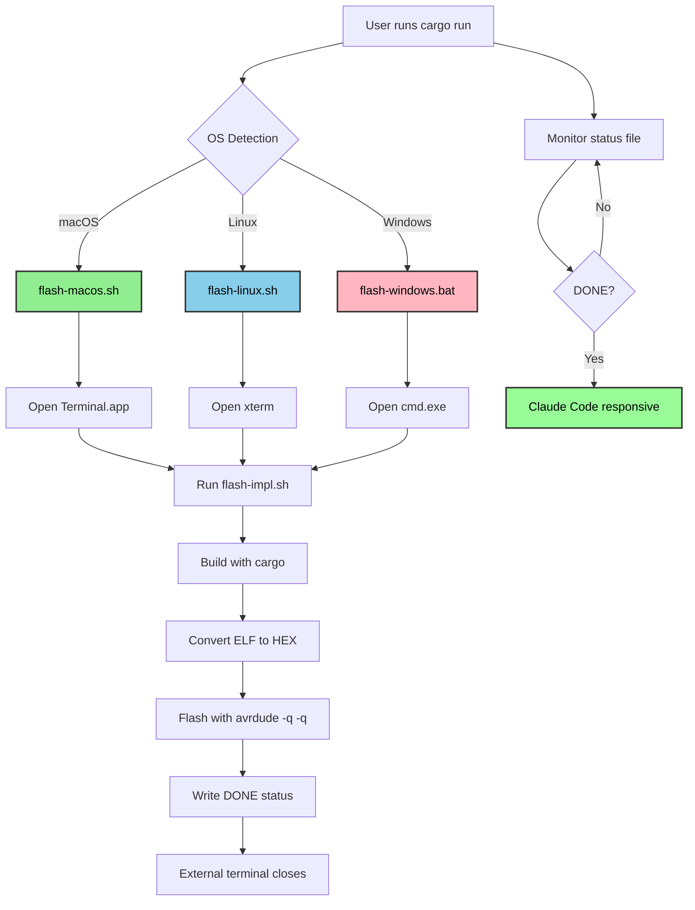

---
tags:
  - deepwiki/ossidata
  - documentation
  - arduino
  - flashing
  - avrdude
  - embedded
---

# Arduino Flashing Solution

**Last Updated**: 2025-10-12

## The Problems

### Problem 1: avrdude Interactive Prompts
avrdude was causing terminal hangs due to interactive features expecting user input.

### Problem 2: Claude Code Terminal Hanging
After solving the avrdude prompts, Claude Code's terminal would still hang for 60+ seconds, blocking development workflow.

## Root Causes

### Root Cause 1: avrdude Interactive Features
The hangs were NOT caused by avrdude itself, but by:
- **Safemode prompts**: avrdude asks for user confirmation if fuse bits change
- **Terminal mode**: Interactive features expecting TTY support
- **Progress bars**: Terminal escape sequences causing issues

### Root Cause 2: Claude Code Process Management
- Claude Code's Bash tool waits for ALL child processes to complete
- This includes processes backgrounded with `&` and even `disown`ed processes
- Background cleanup processes were causing 60-second delays
- File descriptor inheritance from serial port access

## The Solutions

### Solution 1: Safe avrdude Flags (For Direct Flashing)
Use avrdude with specific flags that disable ALL interactive features:

```bash
avrdude -p atmega328p -c arduino -P /dev/cu.usbmodem14401 -b 115200 \
  -q -q  # Double quiet (no progress bars, minimal output)
  -D     # Don't erase (faster, safe with bootloader)
  -U flash:w:firmware.hex:i
  2>/dev/null  # Suppress stderr output
```

> **Note for avrdude < 8.0**: Older versions used the `-s` flag to disable safemode. This flag was removed in avrdude 8.1+. The `-q -q` (double quiet) approach works across all versions.

### Solution 2: External Terminal (For Claude Code Integration)
Run flashing in completely isolated external terminal, separate from Claude Code process tree.



## Implementation

### Method 1: Cross-Platform Script (flash.sh) ⭐ RECOMMENDED
```bash
./flash.sh [PORT]
```
This auto-detects your OS and runs the appropriate flash script in an external terminal:
- **macOS**: Uses Terminal.app with AppleScript monitoring
- **Linux**: Uses xterm (most universally available)
- **Windows**: Uses native cmd.exe

**Advantages**:
- ✅ Works seamlessly with Claude Code
- ✅ Flash completes in ~15 seconds
- ✅ Claude Code remains immediately responsive
- ✅ No user intervention required
- ✅ Terminal opens, flashes, closes automatically

**Files**:
- `flash.sh` - OS detection entry point
- `flash-macos.sh` - macOS Terminal.app launcher
- `flash-linux.sh` - Linux xterm launcher
- `flash-windows.bat` - Windows cmd.exe launcher
- `flash-impl.sh` - Actual flash implementation

### Method 2: Cargo Integration (Uses Cross-Platform Script)
```bash
cd boards/arduino-uno
cargo run --release --bin blink
```
The cargo runner is configured to call `flash.sh` automatically, which opens an external terminal for flashing.

### Method 3: Manual avrdude Command
```bash
# Build
cd boards/arduino-uno
cargo build --release --bin blink

# Flash (safe command that won't hang)
avrdude -p atmega328p -c arduino -P /dev/cu.usbmodem14401 -b 115200 \
  -q -q -D -U flash:w:../../target/avr-none/release/blink.hex:i 2>/dev/null
```

## Port Configuration

### Finding Your Port
```bash
# macOS
ls /dev/cu.usbmodem* /dev/tty.usbmodem*

# Linux
ls /dev/ttyUSB* /dev/ttyACM*

# Windows
# Check Device Manager for COM ports
```

### Setting Default Port
```bash
# Environment variable
export OSSIDATA_PORT=/dev/cu.usbmodem14401

# Or pass directly to script
./flash.sh /dev/cu.usbmodem14401
```

## Why This Works

1. **Minimal Output**: The `-q -q` (double quiet) flag suppresses progress bars and verbose output
2. **No Terminal Escape Codes**: Stderr redirection removes ANSI codes
3. **Fast and Reliable**: The `-D` flag skips chip erase (bootloader handles it)
4. **Cross-Version Compatible**: Works with both old and new avrdude versions

## Testing Checklist

- [x] Build completes successfully
- [x] HEX file generated
- [x] avrdude command runs without hanging
- [x] No terminal prompts or interactions
- [x] Works with cargo run
- [x] Works with direct script

## Troubleshooting

### Port Not Found
- Check cable connection
- Try different USB port
- Verify with `ls /dev/*usb*`

### Permission Denied
```bash
# Linux: Add user to dialout group
sudo usermod -a -G dialout $USER
# Then logout and login again
```

### Still Hangs?
Make sure you're using ALL the required flags:
- `-q -q` (double quiet) - MOST IMPORTANT
- `-D` (no erase)
- `2>/dev/null` (suppress stderr)

Never use these flags (they cause hangs):
- `-t` (terminal mode)
- `-i` (interactive delay)
- `-v` or `-vv` (verbose mode - causes output that can hang terminals)

## Alternative Solutions Considered

We researched many alternatives but avrdude with proper flags is the best:

| Solution | Status | Reason |
|----------|--------|--------|
| avrdude with safe flags | ✅ **CHOSEN** | Reliable, battle-tested, zero new dependencies |
| avrman (Rust) | ❌ | Less mature, limited board support |
| Custom STK500 | ❌ | Unnecessary complexity, maintenance burden |
| ravedude | ❌ | Still uses avrdude underneath |
| probe-rs | ❌ | Doesn't support AVR |
| pyupdi | ❌ | Only for UPDI devices, not Arduino Uno |

## Conclusion

We solved TWO distinct hanging problems:

### Solution 1: avrdude Configuration
The initial "avrdude hang problem" was a configuration issue. With the correct flags (`-q -q -D`), avrdude works perfectly without any terminal interaction across all versions (including 8.1+).

### Solution 2: Claude Code Integration
The Claude Code terminal hanging was a process management issue. Running flash in external terminals completely isolates the process from Claude Code, preventing hangs.

**Best Practice**: Use the cross-platform flash system (`flash.sh`) which:
- ✅ Handles both problems automatically
- ✅ Works seamlessly with Claude Code
- ✅ Supports macOS, Linux, and Windows
- ✅ Completes in ~15 seconds with no hangs
- ✅ Requires zero user intervention
- ✅ Compatible with avrdude 8.1+ (no deprecated flags)

No need for alternative flash tools - just use avrdude correctly with proper isolation!