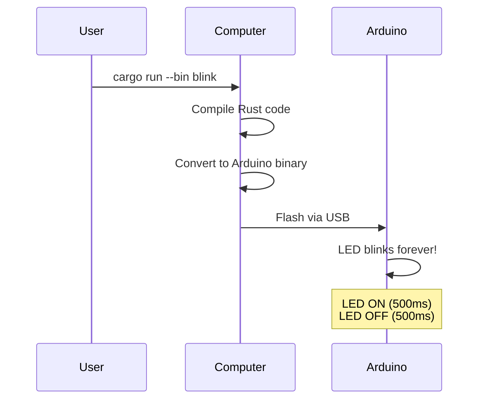
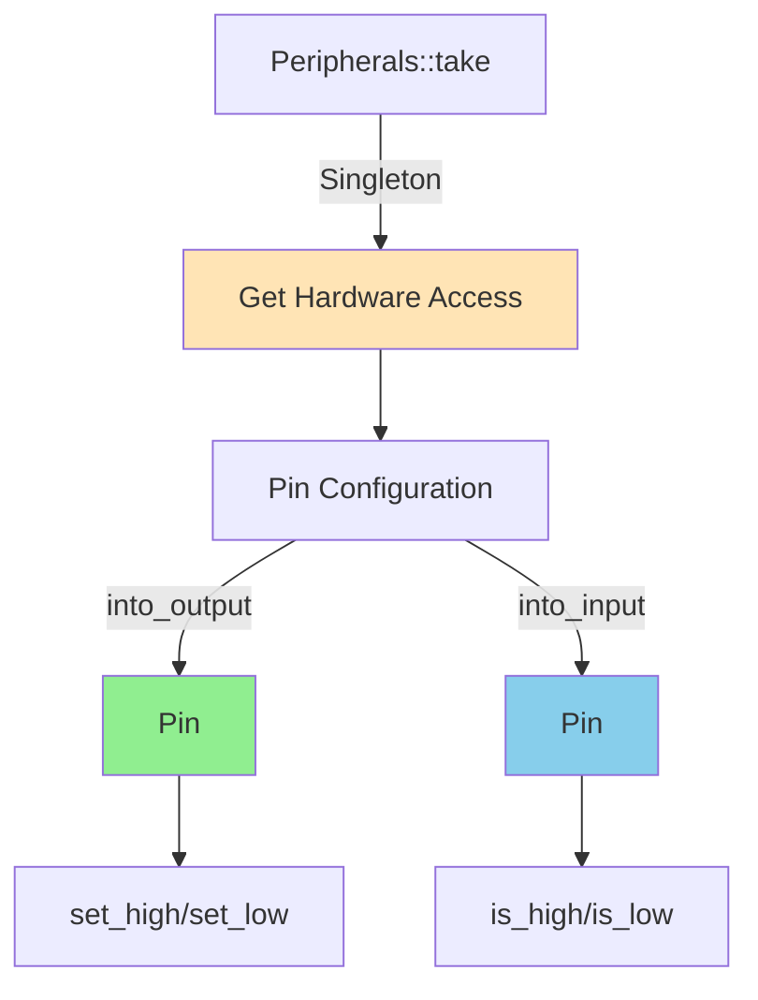

---
tags:
  - deepwiki/ossidata
  - getting-started
  - tutorial
  - setup
  - beginner
---

# Getting Started with Ossidata

**Last Updated**: 2025-10-12

Welcome to Ossidata, a safe and ergonomic Rust SDK for Arduino! This guide will walk you through setting up your development environment and running your first Rust program on an Arduino.

## Prerequisites

Before you begin, ensure you have:
- An Arduino board (Arduino Uno recommended for beginners)
- A USB cable (data-capable, not charge-only)
- A computer running macOS, Linux, or Windows
- Basic familiarity with Rust (not required, but helpful)


## Step 1: Install Rust Toolchain

Ossidata requires a specific nightly Rust version that has been validated with hardware.

### Install Rustup (if not already installed)

```bash
curl --proto '=https' --tlsv1.2 -sSf https://sh.rustup.rs | sh
```

### Install the Validated Toolchain

```bash
# Install the specific nightly version (hardware-validated)
rustup toolchain install nightly-2025-04-27

# Add the rust-src component (required for no_std embedded)
rustup component add rust-src --toolchain nightly-2025-04-27

# Set as default (optional)
rustup default nightly-2025-04-27
```

> **Why this specific version?** We've validated that `nightly-2025-04-27` works perfectly with AVR hardware. Using a different nightly version may cause compilation or runtime issues.

## Step 2: Install AVR Development Tools

### macOS

```bash
# Install AVR-GCC toolchain
brew install avr-gcc

# Install avrdude (for flashing)
brew install avrdude
```

### Linux (Debian/Ubuntu)

```bash
# Install AVR-GCC toolchain
sudo apt-get update
sudo apt-get install gcc-avr avr-libc

# Install avrdude
sudo apt-get install avrdude

# Add your user to the dialout group (for serial access)
sudo usermod -a -G dialout $USER
# Log out and back in for this to take effect
```

### Windows

1. **AVR-GCC**: Download and install from [Microchip](https://www.microchip.com/en-us/tools-resources/develop/microchip-studio/gcc-compilers)
2. **AVRDUDE**: Included with Arduino IDE, or download from [here](https://github.com/avrdudes/avrdude/releases)

## Step 3: Clone the Repository

```bash
git clone https://github.com/radicalkjax/ossidata.git
cd ossidata
```

## Step 4: Connect Your Arduino

1. Connect your Arduino Uno to your computer via USB
2. Find the serial port:

```bash
# macOS
ls /dev/cu.usbmodem* /dev/tty.usbmodem*

# Linux
ls /dev/ttyUSB* /dev/ttyACM*

# Windows (use Device Manager to find COM port)
```

Example output: `/dev/cu.usbmodem14401`

## Step 5: Your First Blink Program

Let's make the built-in LED blink!



### Build and Flash

```bash
cd boards/arduino-uno

# Flash the blink example (opens external terminal)
cargo run --release --bin blink
```

**What happens:**
1. Cargo compiles your Rust code to AVR machine code
2. The flash script opens an external terminal window
3. Your Arduino is flashed in ~15 seconds
4. The terminal closes automatically
5. Your LED starts blinking!

> **Note**: The external terminal approach ensures Claude Code and other development tools remain responsive during flashing. See [FLASHING_SOLUTION.md](FLASHING_SOLUTION.md) for technical details.

### Verify It Works

Look at your Arduino - the built-in LED (usually near pin 13) should be blinking on and off every 500 milliseconds!

## Step 6: Hello World via Serial

Now let's print to the serial console!

### Run the Example

```bash
# Flash the hello_world example
cargo run --release --bin hello_world
```

### Monitor Serial Output

Open a serial monitor to see the output:

```bash
# macOS/Linux
screen /dev/cu.usbmodem14401 9600
# Press Ctrl+A, then K, then Y to exit

# Or use Arduino IDE's Serial Monitor (Tools > Serial Monitor, set to 9600 baud)
```

You should see:

```
Arduino Uno Rust SDK
====================

Hello, World! #0
Hello, World! #1
Hello, World! #2
...
```

## Understanding the Code

Let's look at the blink example:

```rust
#![no_std]                    // No standard library (embedded)
#![no_main]                   // No standard main (we provide our own)

use arduino_uno::{Delay, Peripherals};
use panic_halt as _;          // What to do on panic

#[avr_device::entry]          // Entry point for AVR
fn main() -> ! {              // Never returns (runs forever)
    // Get exclusive access to peripherals
    let peripherals = Peripherals::take()
        .expect("Failed to take peripherals");

    // Configure pin 13 as output (type-safe!)
    let mut led = peripherals.pins.d13.into_output();

    // Create delay helper
    let mut delay = Delay::new();

    // Main loop
    loop {
        led.set_high();       // Turn LED on
        delay.delay_ms(500);  // Wait 500ms
        led.set_low();        // Turn LED off
        delay.delay_ms(500);  // Wait 500ms
    }
}
```

### Key Concepts



1. **`no_std`**: We don't have an operating system, so no standard library
2. **Peripherals Singleton**: Only one instance can access the hardware (safety!)
3. **Type-State Pattern**: Pin modes are checked at compile-time
4. **Never Returns**: Embedded programs run forever (infinite loop)

## Available Examples

```bash
cd boards/arduino-uno

# Basic LED blink
cargo run --release --bin blink

# Serial "Hello, World!" with counter
cargo run --release --bin hello_world

# Button input with pull-up resistor
cargo run --release --bin button

# Interactive serial echo
cargo run --release --bin serial_echo

# Knight Rider LED pattern (multiple LEDs)
cargo run --release --bin led_pattern
```

### Example Descriptions

| Example | Description | Hardware Needed | Difficulty |
|---------|-------------|-----------------|------------|
| **blink** | Blinks built-in LED | None (built-in) | Beginner |
| **hello_world** | Prints to serial console | USB cable | Beginner |
| **button** | Reads button input | Button on pin 2 | Beginner |
| **serial_echo** | Echoes serial input back | USB cable | Intermediate |
| **led_pattern** | Knight Rider animation | 5 LEDs on pins 8-12 | Intermediate |

## Troubleshooting

### "Permission Denied" Error (Linux)

```bash
# Add yourself to the dialout group
sudo usermod -a -G dialout $USER

# Log out and back in, then verify
groups | grep dialout
```

### "Port Not Found" Error

```bash
# Check that Arduino is connected
ls /dev/*usb* /dev/*ACM* /dev/*modem*

# Try a different USB cable (must be data-capable)
# Try a different USB port
```

### Compilation Errors

```bash
# Ensure you're using the correct toolchain
rustup show

# Should show: nightly-2025-04-27

# Clean and rebuild
cargo clean
cargo build --release
```

### Flash Hangs or Timeouts

Our flash system uses external terminals to prevent hanging. If you experience issues:

1. Check that the Arduino is not being used by another program
2. Close Arduino IDE if it's open
3. Verify the port in `.cargo/config.toml` matches your Arduino's port
4. See [FLASHING_SOLUTION.md](FLASHING_SOLUTION.md) for detailed troubleshooting

## Next Steps

Now that you have the basics working:

1. **Modify an Example**: Try changing the blink delay or serial message
2. **Read the API Reference**: [API_REFERENCE.md](API_REFERENCE.md)
3. **Understand the Architecture**: [ARCHITECTURE.md](ARCHITECTURE.md)
4. **Build Your Own Project**: Use examples as templates

## Hardware Wiring Diagrams

### Button Example Wiring


### LED Pattern Example Wiring

```mermaid
graph TD
    A[Pin 8] -->|330Ω| B[LED 1]
    C[Pin 9] -->|330Ω| D[LED 2]
    E[Pin 10] -->|330Ω| F[LED 3]
    G[Pin 11] -->|330Ω| H[LED 4]
    I[Pin 12] -->|330Ω| J[LED 5]

    B --> K[Ground]
    D --> K
    F --> K
    H --> K
    J --> K

    style K fill:#333
```



## Learning Resources

- **Rust Embedded Book**: https://docs.rust-embedded.org/book/
- **AVR Programming**: https://github.com/Rahix/avr-hal
- **embedded-hal Documentation**: https://docs.rs/embedded-hal/
- **Arduino Reference** (for hardware concepts): https://www.arduino.cc/reference/

## Getting Help

- **Issues**: [GitHub Issues](https://github.com/radicalkjax/ossidata/issues)
- **Discussions**: [GitHub Discussions](https://github.com/radicalkjax/ossidata/discussions)
- **Documentation**: [Full documentation](../README.md)

## Success!

Congratulations! You've successfully:
- ✅ Installed the Rust AVR toolchain
- ✅ Built and flashed Rust code to Arduino
- ✅ Made an LED blink with memory-safe code
- ✅ Printed to the serial console

You're now ready to build amazing embedded projects with Rust!

---

**Next**: [API Reference](API_REFERENCE.md) | [Architecture](ARCHITECTURE.md) | [Contributing](../CONTRIBUTING.md)
